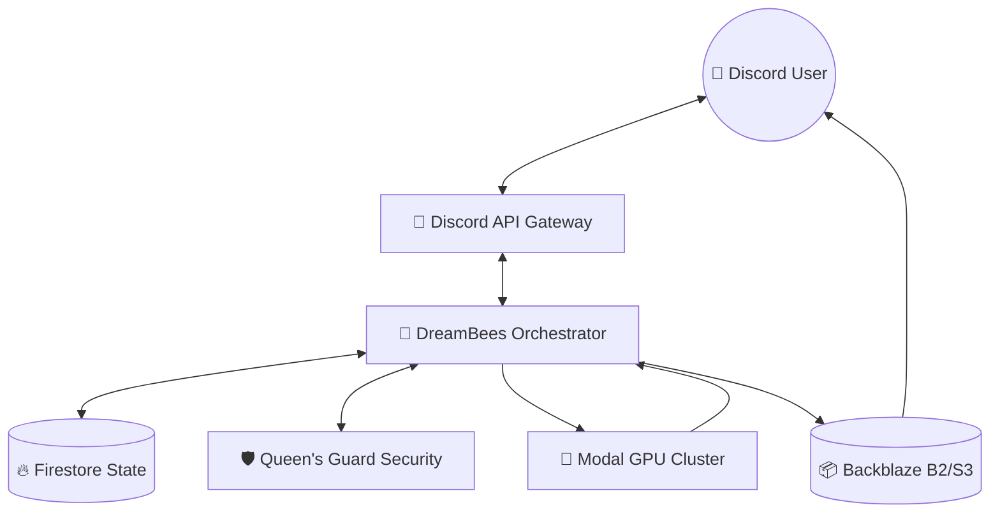
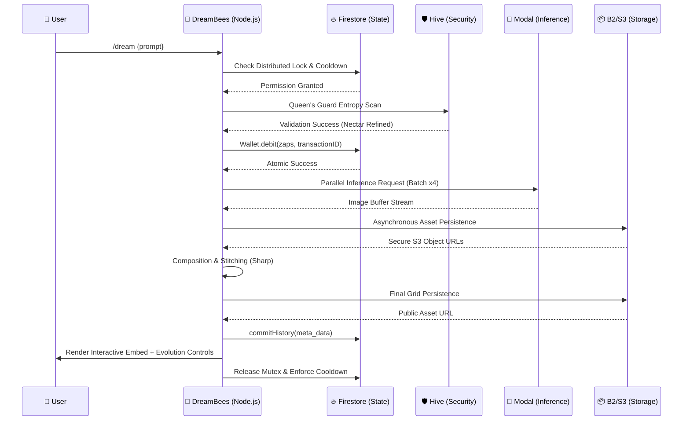
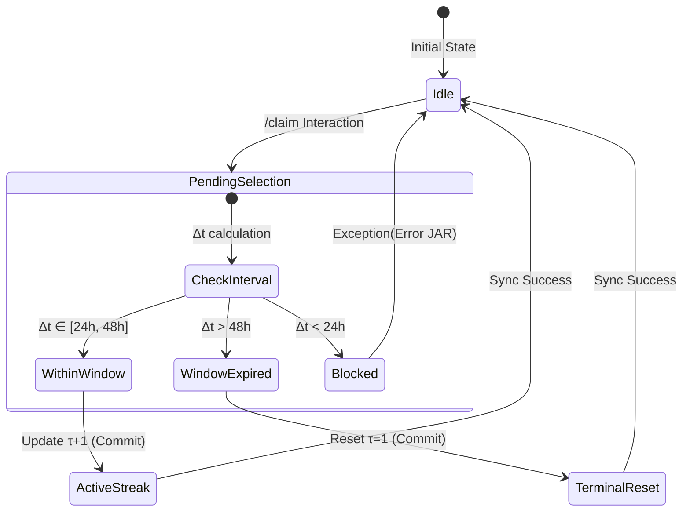

# 🐝 DreamBees Orchestration Engine

[](https://opensource.org/licenses/Apache-2.0)
[](https://nodejs.org/)
[](https://discord.com/invite/curMHRAN8y)
[](https://modal.com)

---

### **Abstract**
DreamBees is a high-performance, distributed orchestration engine designed to bridge the gap between large-scale Discord communities and state-of-the-art Generative AI inference. Built on a cloud-native architecture of **Node.js**, **Google Firestore**, and **Modal**, DreamBees provides a deterministic environment for multi-modal image generation, surgical creative edits (Remixing), and a resilient financial economy—all while maintaining enterprise-grade safety through its multi-layered "Queen's Guard" moderation protocol.

---

## 🏛️ System Architecture

DreamBees operates as a centralized state-machine, delegating compute-heavy inference to serverless GPU clusters and preserving environmental state through atomic database transitions.

### Infrastructure Topology


### Generation Lifecycle (Request Sequence)
The following sequence diagram illustrates the lifecycle of a high-fidelity generation request, emphasizing the synchronous validation and asynchronous asset persistence.



---

## 🧪 Technical Pillars

### 1. Tiered Inference Orchestration
Integration with **Modal** allows for dynamic, serverless scaling of GPU-accelerated inference. DreamBees supports multiple latent diffusion models (SDXL, Flux, Illustrious) through unified API endpoints, ensuring rapid response times even during high-concurrency periods.

### 2. Deterministic "Zap" Economy
All financial transactions are governed by the **Zap Protocol**, which leverages Google Firestore's multi-document atomic transactions. This ensuring absolute financial integrity and prevents race conditions during high-volume generation cycles (e.g., simultaneous claims or multi-batch generations).

### 3. The Queen's Guard (Hive Security)
A multi-layered safety framework that performs:
- **Lexical Analysis**: Filtering sensitive tokens at the ingress layer.
- **Latent Safety**: Post-inference visual auditing.
- **Automated Abuse Backoff**: Dynamic restriction of malicious actors based on interaction frequency.

---

## 🚀 Deployment & Operations

### Prerequisites
- **Runtime**: Node.js `v20.x` (ESM)
- **State Database**: Google Cloud Firestore
- **Asset Storage**: Backblaze B2 or S3-compatible storage
- **Compute Cluster**: Modal CLI & Account credentials

### Setup Procedure

1. **Clone & Initialize**
   ```bash
   git clone https://github.com/DreamBees-AI/DreamBees-DiscordBot.git
   cd DreamBees-DiscordBot && npm install
   ```

2. **Environment Configuration**
   ```bash
   cp .env.example .env
   # Populate with DISCORD_TOKEN, FIREBASE_CONFIG, B2_ENDPOINT, and MODAL_API_KEY
   ```

3. **Orchestration Verification**
   ```bash
   npm run verify    # Validates database and storage connectivity
   npm run register  # Deploys Discord Global Command Schema
   ```

4. **Production Startup**
   ```bash
   pm2 start index.js --name "dreambees-core" --exp-backoff-restart-delay 1000
   ```

---

---

---

## ⚡ Mathematical Foundations (Zap Economy)

DreamBees implements a deterministic resource management system where user interactions are governed by formal distribution and consumption functions, ensuring long-term economic stability and incentive alignment.

### 1. Resource Distribution (Daily Claims)
The reward function $R(\tau)$ for a user with streak $\tau$ is defined as follows:

$$ R(\tau) = B + \min((\tau - 1) \cdot \beta, M) $$

| Variable | Definition | Production Value |
| :--- | :--- | :--- |
| $B$ | **Base Reward**: The initial Zaps granted per claim. | 100 ⚡ |
| $\beta$ | **Streak Bonus**: Incremental reward per contiguous day. | 10 ⚡ |
| $M$ | **Maximum Cap**: The upper boundary for cumulative bonuses. | 100 ⚡ |
| $\tau$ | **Streak Interval**: The number of contiguous successful claims. | $1, n \dots$ |

#### 🕒 Temporal Constraint (The 48h Window)
The streak state $\tau$ at interval $n+1$ is modeled as a discrete state transition governed by the **Theorem of Continuity ($\Theta$)**. This theorem defines the valid temporal boundaries $\Delta t = t_{n+1} - t_n$ for which a streak remains monotonic.

$$ \Theta = \{ (t_n, t_{n+1}) \mid \Delta t \in [24\text{h}, 48\text{h}] \} $$

**Transition Function ($F$):**
The system's state machine mapping $F(s_n, t_{n+1})$ defines the behavioral outcomes for each interaction:
$$ F(s_n, t_{n+1}) = \begin{cases} \text{Continuous}(\tau_n + 1) & \text{if } \Delta t \in \Theta \\ \text{Reset}(1) & \text{if } \Delta t > 48\text{h} \\ \text{Blocked} & \text{if } \Delta t < 24\text{h} \end{cases} $$

- **Grace Period (Incentive Physics)**: The **48-hour upper bound** is a deliberate "Grace Period" designed as a psychological buffer for user retention. It provides flexibility for real-world user availability while maintaining the 24-hour periodic engagement target.
- **Monotonicity & Architectural Integrity**: To ensure state integrity, $\Delta t$ is calculated using the **Firestore `serverTimestamp()`**. This provides a monotonic, server-side source of truth that is immune to local machine clock manipulation and timezone exploits.
- **Stratified Time Segments**: The 24-hour lower bound is enforced by a deterministic UTC identifier (`claim-YYYY-MM-DD`), ensuring only one state increment $\tau \to \tau+1$ is possible per universal day.



---

### 2. Resource Consumption (Inference Costs)
The batch cost function $C(\mu, n)$ for model $\mu$ and request size $n$ is:

$$ C(\mu, n) = \lceil n \cdot \kappa_\mu + \gamma \rceil $$

| Variable | Definition | Reference |
| :--- | :--- | :--- |
| $\kappa_\mu$ | **Model Efficiency**: Base Zap cost per individual image. | Model Registry |
| $\gamma$ | **Orchestration Tax**: System overhead and processing fee. | $\gamma \ge 0$ |
| $n$ | **Request Batch**: Number of concurrent generations (e.g., x4). | User Input |

---

### 3. Practical Illustrations

| Scenario | Calculation | Total Cost / Reward |
| :--- | :--- | :--- |
| **New User Claim** | $100 + \min(0 \cdot 10, 100)$ | **100 ⚡** |
| **Day 5 Streak Claim** | $100 + \min(4 \cdot 10, 100)$ | **140 ⚡** |
| **Day 15 Streak Claim** | $100 + \min(14 \cdot 10, 100)$ | **200 ⚡ (Cap)** |
| **Standard "Dream" HQ Batch (x4)** | $\lceil 4 \cdot 1.0 + 0 \rceil$ | **4 ⚡** |
| **Rapid "Flash" Batch (x4)** | $\lceil 4 \cdot 0.5 + 0 \rceil$ | **2 ⚡** |

---

## 🔬 Future Research & Development (R&D)

The DreamBees team is continuously exploring advanced orchestration techniques to bridge the gap between creative freedom and system stability:

- **Predictive Resource Allocation**: Heuristic models to pre-warm GPU clusters based on Discord interaction peaks.
- **Latent Space Auditing**: Integrating post-inference visual safety checks to catch high-fidelity artifacts.
- **Semantic Interaction Tracing**: Mapping recursive creativity (Remixes) to visualize lineage murals across the user base.

---

## 📖 Glossary of Terms

| Term | Technical Definition |
| :--- | :--- |
| **Nectar** | Raw user-provided text prompt input before preprocessing. |
| **Hive** | The unified Discord ecosystem and service cluster. |
| **Queen's Guard** | The multi-layered safety and moderation protocol ($S(I)$). |
| **Zap** | The primary unit of currency used to manage inference resources. |
| **Orchestrator** | The Node.js core responsible for state machine management. |
| **Prism of Dimensions** | The multi-modal generation interface for creative exploration. |

---

## 🧠 Technical Documentation (Deep Dive)

- **[🏛️ Architecture Overview](./docs/architecture.md)**: Logic flows and service definitions.
- **[🛡️ Safety & Moderation](./docs/safety.md)**: Queen's Guard logic and security tiers.
- **[⚡ Zap Economy](./docs/economy.md)**: Transactional lifecycle and financial auditing.
- **[📊 Data Model](./docs/data-model.md)**: Schema Definitions and ERDs.
- **[🧬 Evolution UX](./docs/ux-interactions.md)**: Surgical edits and lineage murals.
- **[📜 Technical Specification (Whitepaper)](./docs/SPECIFICATION.md)**: Formal system specification and models.

---

## 🤝 Community & Contribution

- **Discord**: [Join the Hive](https://discord.com/invite/curMHRAN8y)
- **Security**: For vulnerability reporting, see [SECURITY.md](./SECURITY.md).
- **Standards**: Development follows the [Apache 2.0 License](./LICENSE).

*Developed with ❤️ for the future of AI-assisted creativity.*
