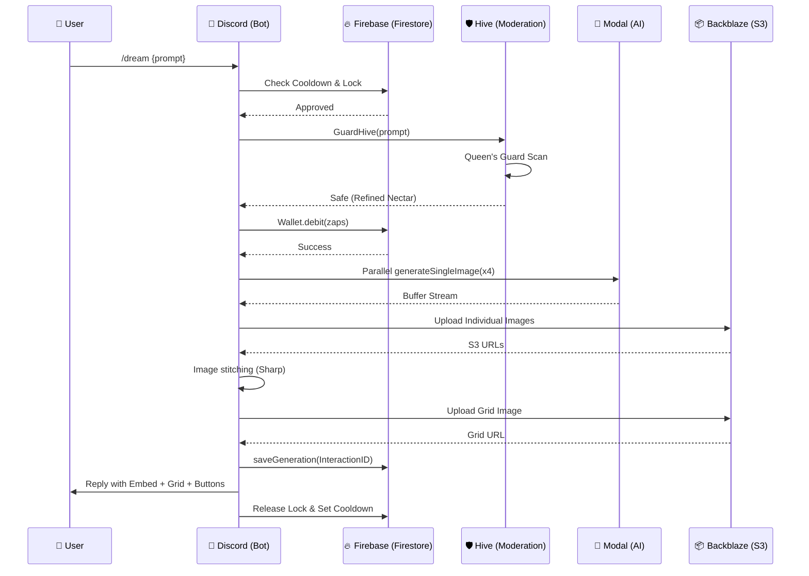

# 🏛️ DreamBees Architecture

DreamBees is an orchestration-heavy Discord bot that connects Discord users to state-of-the-art AI inference through a tiered system of security, economy, and storage.

---

## 🛰️ High-Level Service Overview

- **Discord API**: Interaction interface (Slash commands, buttons, modals).
- **Firebase Firestore**: Persistent state management (Users, Generations, Locks, Cooldowns).
- **Backblaze B2/S3**: Asset storage for generated images and user-uploaded content.
- **Modal AI**: GPU-accelerated inference cluster for image generation (SDXL, Flux, WA Illustrious).
- **DreamBees Web App**: Visualization and cross-platform management.

---

## 🔄 Generation Lifecycle (Sequence Diagram)

The following diagram illustrates the lifecycle of a single `/dream` request.

---

## 🧩 Core Components Map

| Module | Responsibility |
| :--- | :--- |
| `index.js` | Bot initialization and global event orchestration. |
| `lib/generator.js` | The main task manager for AI creation. |
| `lib/hive.js` | Security gatekeeper and moderation voice. |
| `lib/wallet.js` | Financial integrity and atomic Zap transactions. |
| `lib/image-processor.js` | Local image manipulation using `sharp`. |
| `lib/s3.js` | Abstraction for Backblaze B2 cloud storage. |
| `lib/discord-ux.js` | UI generation for complex Discord interactions (Embeds, Buttons). |

---

## ⚖️ Concurrency & Reliability

- **Circuit Breaker**: `isCircuitOpen()` checks for API health to prevent cascading failures.
- **Locks**: Per-user Firestore locks prevent redundant generation requests.
- **Retry Logic**: `uploadToS3WithRetry` ensures assets are stored even during transient network spikes.
- **Abuse Backoff**: Integrated with the Hive moderation to automatically restrict malicious actors.
