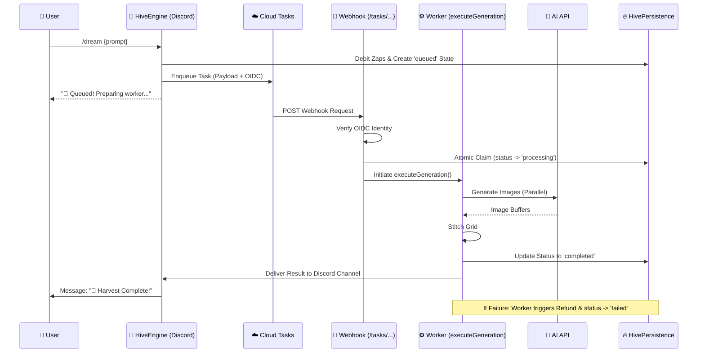

# 🐝 Google Cloud Tasks: The Hive's Asynchronous Engine

The DreamBees Discord Bot utilizes **Google Cloud Tasks** as its primary asynchronous processing engine. This architecture ensures that long-running image generation tasks (which can take between 30 to 300 seconds) are handled reliably without blocking the Discord client or risking interaction timeouts.

---

## 🏗️ Architectural Deep Dive (Sovereign v4)

### High-Level Workflow Sequence

---

## 🧩 Core Components & Files

### 1. **The Dispatcher** (`src/core/HiveEngine.ts`)
Integrated directly into the `HiveEngine` pillar.
- **`enqueueGeneration(payload)`**: 
    - Saves the initial record to `artbot_generations` with `status: 'queued'`.
    - Packages the interaction metadata into a Cloud Task.
    - Configures OIDC with the service account and audience (Webhook URL).
    - Dispatches to the configured Google Cloud region.

### 2. **The Webhook Listener** (`src/core/HiveEngine.ts`)
The unified HTTP server within the monolith (defaulting to port 8080).
- **Route**: `POST /tasks/process-generation`
- **Identity Locking**: Validates the OIDC Bearer token via `google-auth-library`.
- **Idempotency (Claiming)**: Uses `hivePersistence.claimTask()` to ensure a task is only processed once, even if Cloud Tasks retries the delivery.

### 3. **The Worker** (`src/core/HiveEngine.ts`)
The background execution logic (`executeGeneration`).
- **Concurrency Control**: Uses a dedicated `workerLimit` (default 2) to prevent instance OOM from simultaneous AI calls.
- **AI Integration**: Calls `HiveGenerator` for generation or remixing.
- **Autonomous Recovery**: If the AI model fails or a network error occurs, the worker **automatically issues a refund** to the user and updates the record to `failed`.

### 4. **The Persistence Layer** (`src/services/HivePersistence.ts`)
Manages all atomic state transitions.
- **`claimTask(id)`**: Transactionally moves a generation from `queued` to `processing`.
- **`refund(id, reason)`**: Atomically returns Zaps to the user and marks the transaction as `refunded`.

---

## 🛡️ Security Model: OIDC & Identity Locking

Cloud Tasks doesn't just send a request; it sends a **proof of identity**.

1.  **Audience Binding**: The token generated by Cloud Tasks is bound to the `TASK_WEBHOOK_URL`. If the bot receives a token meant for another service, it will be rejected.
2.  **Issuer Verification**: The bot verifies the token is signed by Google's public keys.
3.  **Service Account Check**: In production, the bot ensures the `email` claim in the token matches the expected `CLOUD_TASKS_SA_EMAIL`.
4.  **Dev Mode Bypass**: In `development` mode, the OIDC check can be bypassed to allow tool-based testing (e.g. `scripts/test_webhook.ts`).

---

## ⚙️ Configuration & Environment

| Variable | Importance | Description |
| :--- | :--- | :--- |
| `GCLOUD_PROJECT` | **Required** | The ID of your Google Cloud Project. |
| `CLOUD_TASKS_LOCATION` | **Required** | The region where the queue resides (e.g., `us-central1`). |
| `CLOUD_TASKS_QUEUE` | **Required** | The specific queue name. |
| `CLOUD_TASKS_SA_EMAIL` | **Critical** | The Service Account email used for OIDC signing. |
| `TASK_WEBHOOK_URL` | **Required** | The full public URL of the bot's task endpoint. |
| `WORKER_CONCURRENCY`| **Optional** | Max simultaneous tasks per bot instance (default: 2). |

---

## 🚀 Adding New Task Types

To add a new asynchronous task (e.g., "Upscaling" or "Video Generation"):

1.  **Update Routes**: Add a pathname check in `HiveEngine.initializeServer()`.
2.  **Add Processing Method**: Implement the new logic in `HiveEngine` (like `executeGeneration`).
3.  **Update Persistence**: Ensure status tracking and refund paths are supported in `HivePersistence`.
4.  **Register the Webhook**: Ensure the new route path is allowed in your Cloud Tasks configuration.

---

## 🧪 Local Deployment Tip

When developing locally, Google Cloud Tasks cannot reach your `localhost`. Use **ngrok** to expose your port (e.g., 8080) and set `TASK_WEBHOOK_URL` to the ngrok forwarding address.

**Note**: To bypass OIDC verification locally, ensure `this.config.NODE_ENV` is set to `development`.

### 📡 Production Connectivity Note
In production, ensure the `TASK_WEBHOOK_URL` uses a **Static External IP** or a persistent domain. If the GCE instance restarts with a new ephemeral IP, Cloud Tasks will fail to deliver payloads, resulting in stuck generations.
 Setup Guide](deployment.md#️-prerequisites-day-0-setup)**.
