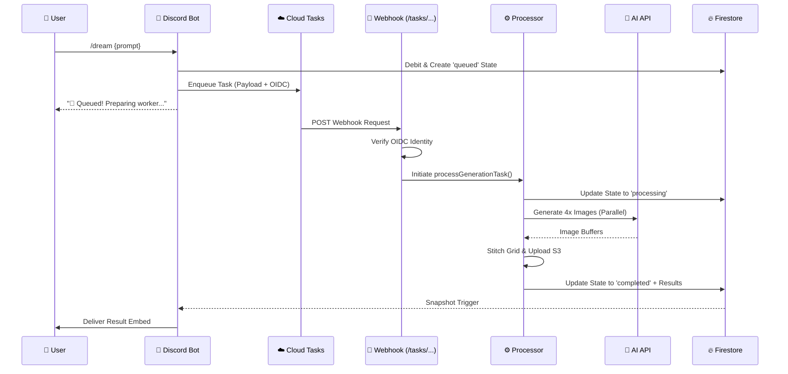

# 🐝 Google Cloud Tasks: The Hive's Asynchronous Engine

The DreamBees Discord Bot utilizes **Google Cloud Tasks** as its primary asynchronous processing engine. This architecture ensures that long-running image generation tasks (which can take between 60 to 300 seconds) are handled reliably without blocking the Discord client or risking interaction timeouts.

---

## 🏗️ Architectural Deep Dive

### High-Level Workflow Sequence

---

## 🧩 Core Components & Files

### 1. **The Dispatcher** (`lib/queue/cloudtasks.js`)
Responsible for packaging and sending tasks to Google Cloud.
- **`createCloudTask(payload, options)`**: 
    - Construct the parent queue path.
    - Encodes the payload (requestId, prompt, modelId, user info) into Base64.
    - Configures the OIDC token with the correct service account and audience.
    - Implements production hardening by failing fast if critical config is missing.

### 2. **The Webhook Listener** (`index.js`)
An HTTP server (defaulting to port 8080) that serves as the entry point for Cloud Tasks.
- **Route**: `POST /tasks/process-generation`
- **Verification**: `verifyOidcToken(req)` uses `google-auth-library` to validate the Google-signed token.
- **Identity Locking**: Strictly checks the issuer and email against `CLOUD_TASKS_SA_EMAIL` to prevent unauthorized task injection.

### 3. **The Processor** (`lib/queue/processor.js`)
The stateless execution unit for generation tasks.
- **`processGenerationTask(payload, options)`**:
    - **Idempotency**: Checks Firestore if the task is already completed (prevents double-billing).
    - **Concurrency**: Uses `p-limit` for parallel image generation and S3 uploads.
    - **Atomic Updates**: Uses Firestore batches to update generation records, transaction logs, and queue status in a single round-trip.
    - **Self-Healing**: Automatically triggers `Wallet.refund()` on fatal processing errors.

### 4. **The Orchestrator** (`lib/generator.js`)
The stateful manager that connects the Discord UI to the background task.
- **`performGeneration(...)`**:
    - Manages per-user locks (`tryLock`) to prevent spam.
    - Subscribes to the Firestore document using `onSnapshot` to react to state changes in real-time.
    - Implements a **300s Hard Timeout** safety net to prevent hanging interaction listeners.

---

## 🛡️ Security Model: OIDC & Identity Locking

Cloud Tasks doesn't just send a request; it sends a **proof of identity**.

1.  **Audience Binding**: The token generated by Cloud Tasks is bound to the `TASK_WEBHOOK_URL`. If the bot receives a token meant for another service, it will be rejected.
2.  **Issuer Verification**: The bot verifies the token is signed by Google's public keys.
3.  **Service Account Check**: In production, the bot ensures the `email` claim in the token matches the expected `CLOUD_TASKS_SA_EMAIL`.

---

## ⚙️ Configuration & Environment

| Variable | Importance | Description |
| :--- | :--- | :--- |
| `GCLOUD_PROJECT` | **Required** | The ID of your Google Cloud Project. |
| `CLOUD_TASKS_LOCATION` | **Required** | The region where the queue resides (e.g., `us-central1`). |
| `CLOUD_TASKS_QUEUE` | **Required** | The specific queue name. |
| `CLOUD_TASKS_SA_EMAIL` | **Critical** | The Service Account email used for OIDC signing. |
| `TASK_WEBHOOK_URL` | **Required** | The full public URL of the bot's task endpoint. |

---

## 🛠️ Operational Guide

### Common Error Troubleshooting

| Error Symptom | Potential Cause | Solution |
| :--- | :--- | :--- |
| `403 Unauthorized Task Delivery` | OIDC Token Mismatch | Check `CLOUD_TASKS_SA_EMAIL` and `TASK_WEBHOOK_URL` match Google Cloud settings. |
| `503 Service Unavailable` | Bot Health Failure | Check `/healthz` endpoint. Discord client might be offline or DB disconnected. |
| `Task Timeout (300s)` | Generation hung | Inspect `processor.js` logs for AI API hang or S3 upload failure. |
| `Duplicate Generation` | Idempotency Check Fail | Ensure Firestore `requestId` is correctly passed and checked in `processor.js`. |

### Performance & Limits
- **Max Global Queue**: Configured in `generator.js` (default 500). Prevents the system from being overwhelmed.
- **Task Payload Limit**: Max 1MB body size enforced by the webhook listener.
- **HTTP Server Timeout**: Set to 5 minutes to accommodate slow generation batches.

---

## 🚀 Adding New Task Types

To add a new asynchronous task (e.g., "Upscaling" or "Video Generation"):

1.  **Define a new route**: Add a pathname check in the `index.js` HTTP server.
2.  **Create a Dispatcher**: Add an enqueuing function in `lib/queue/cloudtasks.js`.
3.  **Implement the Processor**: Add a corresponding processing function in `lib/queue/processor.js`.
4.  **Register the Webhook**: Ensure the new route path is allowed in your Cloud Tasks configuration.

---

## 🧪 Local Development Tip

When developing locally, Google Cloud Tasks cannot reach your `localhost`. Use **ngrok** to expose your port (e.g., 8080) and set `TASK_WEBHOOK_URL` to the ngrok forwarding address.

**Note**: To bypass OIDC verification locally, you can set `NODE_ENV=development`, but ensure this is **never** done in a production environment.
