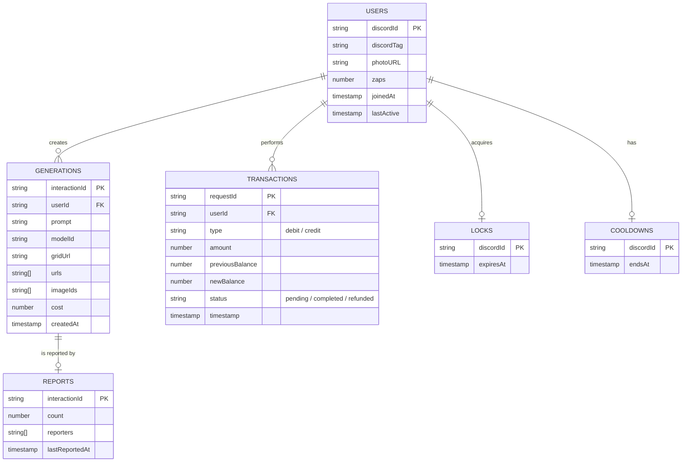

# 📊 Data Model & Storage Strategy

DreamBees uses a combination of **Google Firestore** for metadata, user profiles, and state management, and **Backblaze B2/S3** for heavy asset storage.

---

## 🔥 Firestore Entity Relationship Diagram (ERD)

The following diagram illustrates the relationships between the various Firestore collections.



---

## 📦 Storage Strategy (Backblaze B2)

Assets are stored in a hierarchical structure within the `B2_BUCKET` to ensure efficient retrieval and organization.

### Directory Structure
```text
/
├── generations/
│   ├── {interactionId}_0.webp  (Individual Image 1)
│   ├── {interactionId}_1.webp  (Individual Image 2)
│   ├── {interactionId}_2.webp  (Individual Image 3)
│   └── {interactionId}_3.webp  (Individual Image 4)
├── discord-grids/
│   └── {interactionId}.webp    (Stitched 2x2 Grid)
└── uploads/
    └── {userId}/{timestamp}.png (User-uploaded assets for Remix)
```

### Format & Compression
- **WebP**: All generated images are stored as lossy WebP to minimize storage costs and maximize loading speed in Discord embeds.
- **Resolution**: Standard generations are optimized at 1024x1024 (before stitching).

---

## 🛠️ Consistency & Recovery

- **Atomic Transactions**: All balance changes (Zaps) and claim logic are wrapped in Firestore transactions to prevent data corruption.
- **Idempotency**: Every transaction is indexed by `requestId` (InteractionID), ensuring that a single Discord button click never bills a user twice.
- **Lock Auto-Expiration**: Generation locks in `artbot_locks` automatically expire after 5 minutes, ensuring that a bot crash doesn't permanently block a user from generating.
