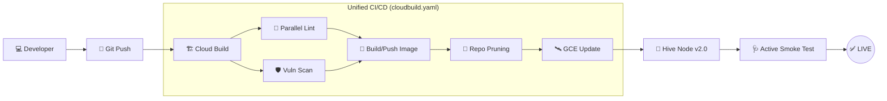

# 🚢 Industrial-Grade Deployment & Unified CI/CD (v3.0)

The DreamBees Hive Node is designed for mission-critical reliability on Google Cloud Platform. It utilizes a state-of-the-art **Build-Scan-Deploy** orchestration pipeline that ensures maximum security, performance, and uptime.

---

## 🔄 Deployment Lifecycle (Automated Pipeline)

The following diagram illustrates the flow from a code commitment to the automated verification of a running production instance.



---

## 🛠️ Prerequisites (Day 0 Setup)

Before triggering the deployment pipeline, ensure your Google Cloud environment is properly configured.

### 1. Enable Required APIs

```bash
gcloud services enable \
    compute.googleapis.com \
    cloudbuild.googleapis.com \
    artifactregistry.googleapis.com \
    cloudtasks.googleapis.com \
    firestore.googleapis.com
```

### 2. Infrastructure Provisioning

#### **Artifact Registry (Docker Repository)**
```bash
gcloud artifacts repositories create dreambees-bot-repo \
    --repository-format=docker \
    --location=us-central1 \
    --description="DreamBees Hive Node Images"
```

#### **Static Global IP (Critical for Webhooks)**
To ensure `TASK_WEBHOOK_URL` remains stable across restarts, reserve a static external IP:
```bash
gcloud compute addresses create dreambees-static-ip --region=us-central1
```

#### **Cloud Tasks Queue**
```bash
gcloud tasks queues create dreambees-generation-queue \
    --location=us-central1 \
    --max-dispatches-per-second=10 \
    --max-concurrent-tasks=50
```

#### **GCE Hive Node Instance**
```bash
# Instance creation with Static IP attachment
gcloud compute instances create-with-container dreambees-hive-node \
    --zone=us-central1-a \
    --machine-type=e2-small \
    --address=dreambees-static-ip \
    --container-image=us-central1-docker.pkg.dev/[PROJECT_ID]/dreambees-bot-repo/dreambees-discord-bot:latest \
    --scopes=cloud-platform \
    --tags=http-server,https-server \
    --labels=service=dreambees-bot
```

---

## 🛡️ Security & Identity (IAM Permissions)

The GCE instance should run under a dedicated **Service Account** with the following granular permissions:

| Role | Purpose |
| :--- | :--- |
| `roles/datastore.user` | Read/Write access to Firestore state and locks. |
| `roles/cloudtasks.enqueuer` | Ability to push generation tasks to the queue. |
| `roles/artifactregistry.reader` | Ability to pull updated container images. |
| `roles/logging.logWriter` | Writing system logs to Cloud Logging for observability. |

> [!CAUTION]
> Avoid using the `Compute Engine default service account` (Editor role) in production. Create a restricted account and assign it to the instance using `--service-account=[SA_EMAIL]`.

---

## 🏗️ Docker Engineering: The "Vault" Pattern

The bot uses a high-efficiency multi-stage `Dockerfile` focused on **Industrial-Grade Isolation**.

- **Base Image**: `node:20-bookworm-slim` (for glibc compatibility with `sharp`).
- **Immutable OS**: The container runs with a **Read-Only Root Filesystem**. This prevents runtime tampering and ensures the highest possible security posture.
- **Walled Garden (tmpfs)**: A writable memory space is mounted at `/tmp` for temporary image processing, buffers, and cache.
- **OOM Resilience**: Node.js is hard-coded with `--max-old-space-size=1536` to ensure deterministic garbage collection within GCE `e2-small` RAM limits.

---

## 🚀 Unified Pipeline (v3.0)

We have centralized the entire deployment lifecycle into a single **Cloud Build Manifest (`cloudbuild.yaml`)**.

### 🏗️ Orchestration Steps:
1. **Parallel Pre-checks**: Runs `npm run lint` and `npm run verify` concurrently in the cloud to catch errors before building.
2. **Accelerated Build**: Uses the **Kaniko Executor** for 10x better layer caching for multi-stage Dockerfiles.
3. **Security Gating**: Automatically performs an **On-Demand Vulnerability Scan** of every new image.
4. **Security Checkpoint**: Automatically **fails the build** if High or Critical severity vulnerabilities are detected.
5. **Registry Pruning**: Automatically deletes obsolete images, keeping only the most recent 3 versions to manage costs.
6. **Atomic Deployment**: Updates the GCE instance container with the new image, `tmpfs` mounts, and non-privileged security context.

---

## 📡 Environment Variable Reference

The bot's deployment script (`deploy-gce.sh`) injects secret logic into GCE metadata.

| Variable | Scope | Description |
| :--- | :--- | :--- |
| `DISCORD_TOKEN` | **Critical** | The primary bot token from the Discord Developer Portal. |
| `DISCORD_CLIENT_ID` | **Required** | The Application ID for OAuth and slash command registration. |
| `FIREBASE_API_KEY` | **Required** | API Key for Firestore state persistence. |
| `DREAMBEES_API_KEY` | **Critical** | Authentication key for Modal-based AI inference. |
| `CLOUD_TASKS_SA_EMAIL` | **Security** | Service Account email for OIDC-signed task delivery validation. |
| `TASK_WEBHOOK_URL` | **Required** | Public URL pointing to `/tasks/process-generation`. |

---

## 📈 Day 2 Operations (Management & Debugging)

### 📊 Log Analysis
View the real-time interaction stream via **Cloud Logging**:
```bash
gcloud logging read "resource.type=gce_instance AND resource.labels.instance_id=dreambees-hive-node" --limit 50
```

### 🧐 Troubleshooting Crashes
If the bot fails to start, inspect the **Serial Port Output** for kernel or container runtime errors:
```bash
gcloud compute instances get-serial-port-output dreambees-hive-node --zone=us-central1-a | tail -n 100
```

### ⚡ Scaling Strategy
- **Horizontal**: The bot is stateless; however, Discord only allows one active Gateway connection per bot token without sharding.
- **Vertical**: If `OOM_KILLED` errors appear, upgrade the machine type:
  ```bash
  gcloud compute instances set-machine-type dreambees-hive-node --machine-type=e2-medium
  ```

### 🩺 Health Monitoring
```bash
# Verify the bot is Mission-Ready
curl http://[STATIC_IP]:8080/healthz
```
Response includes status (UP/DEGRADED), individual dependency health (Discord, DB, APIs), memory usage, and the current build version.

---

## 📈 Security Hardening Summary
- [x] Read-Only Root Filesystem
- [x] Automated Vulnerability Gating
- [x] Non-Privileged User Execution
- [x] Automated Secret Masking in Logs
- [x] Service-Level Circuit Breaking (Partial Degradation)
