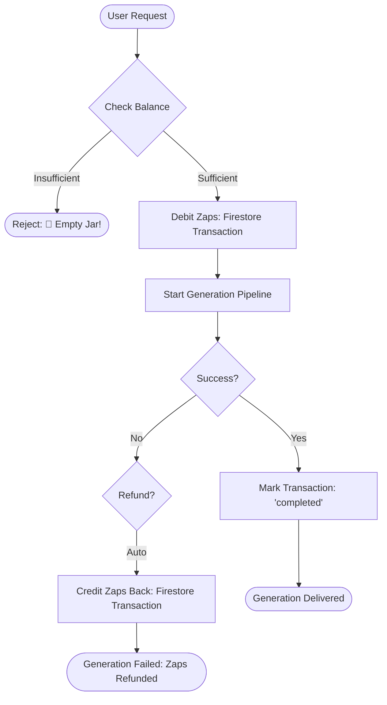

# ⚡ The Zap Economy

DreamBees features an integrated currency system known as **Zaps**. This system powers the generation pipeline and ensures fair resource distribution among Hive members.

---

## 🍯 What are Zaps?

Zaps are the energy source for the DreamBees worker bots. Every action in the Hive (generation, upscaling, remixing) requires a specific amount of Zaps.
- **Initial Provisioning**: New users are automatically granted **100 Zaps** upon their first interaction.
- **Daily Rewards**: Users can claim additional Zaps daily via the `/claim` command.
- **Dynamic Pricing**: Costs are calculated based on model complexity and batch size.

---

## 🔄 Transaction Lifecycle (Flowchart)

The following diagram illustrates the atomic lifecycle of a Zap transaction during image generation.

---

## 🏛️ Wallet Architecture

The `Wallet` class (`lib/wallet.js`) provides an abstraction layer over Firestore transactions to ensure financial integrity.

### Atomic Operations
- **`debit(uid, amount, requestId)`**: Decrements a user's balance. This is performed inside a Firestore transaction to prevent double-spending.
- **`credit(uid, amount, requestId)`**: Increments a user's balance (used for rewards and refunds).
- **`refund(requestId)`**: Automatically reverts a specific debit transaction if the corresponding generation fails.

---

## 📊 Transaction Logging

Every financial activity is logged in the `artbot_transactions` collection:
- `userId`: The Discord ID of the user.
- `amount`: The number of Zaps (negative for debits, positive for credits).
- `type`: The transaction category (`generation`, `reward`, `refund`).
- `requestId`: The Interaction ID that triggered the transaction.
- `timestamp`: Server-side completion time.

---

## 🛡️ Economic Safeguards

- **Negative Balance Protection**: Transactions are rejected if the resulting balance would be negative.
- **Idempotency**: Requests are tracked by `InteractionID` to prevent accidental double-billing for the same command.
- **Admin Overrides**: Administrators can manually adjust balances via internal scripts or the `/config` module.
