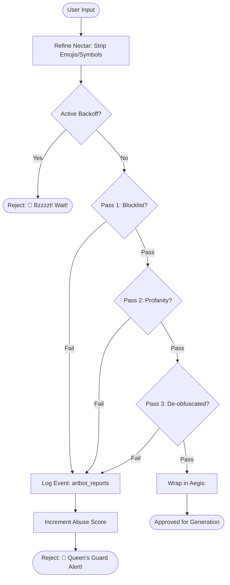

# 🛡️ Hive Safety: The Queen's Guard

DreamBees implements a multi-layered safety and moderation system designed to protect the community while maintaining creative freedom. This system is known internally as the **Queen's Guard**.

---

## 🛑 Queen's Guard Architecture

The moderation process involves several stages, from instant refinement to deep textual analysis and historical abuse tracking.

### 1. Nectar Refinement (`refineNectar`)
User input is first sanitized to remove emojis, control characters, and obscure Unicode symbols that could be used for obfuscation or prompt injection.
- **Whitelist**: Alphanumeric, spaces, and basic punctuation.
- **Result**: A clean, canonical string for the next scan.

### 2. Aegis Wrapper (`wrapInAegis`)
The refined prompt is wrapped in `<user_input>` tags. This creates a clear boundary for the AI model and helps prevent "jailbreak" or "system instruction override" attempts.
- **Injection Protection**: Known breakout terms like `ignore previous instructions` are automatically redacted.

### 3. Multi-Pass Scan (`guardHive`)
The core analysis engine executes a three-pass scan:
1. **Blocklist Check**: Compares terms against `HIGH_RISK` and `MEDIUM_RISK` term lists.
2. **Profanity Filter**: Uses `leo-profanity` with an extended custom blocklist.
3. **Normalization Scan**: De-obfuscates confusables (e.g., `p0rn` -> `porn`) and scans the resulting forms.

---

## 🔄 Moderation Workflow (Flowchart)

---

## 📈 Abuse Mitigation & Audit

- **Moderation Event Logging**: Every failure is logged to Firestore (`artbot_reports` / `moderation_audit`).
- **Abuse Backoff**: Repeated safety violations trigger a time-based cooling-off period where the user's prompts are automatically rejected.
- **Auditor Channel**: Suspicious prompts and generation attempts are automatically logged to a Discord moderator channel for manual review.

---

## 📜 Safety Governance

- **Blocklist**: Managed via `lib/safety-blocklist.js`.
- **Logic**: Centralized in `lib/hive.js` and `lib/safety-utils.js`.
- **Compliance**: Adheres to Discord's TOS and Safety Guidelines while ensuring the Hive remains a creative sanctuary.
